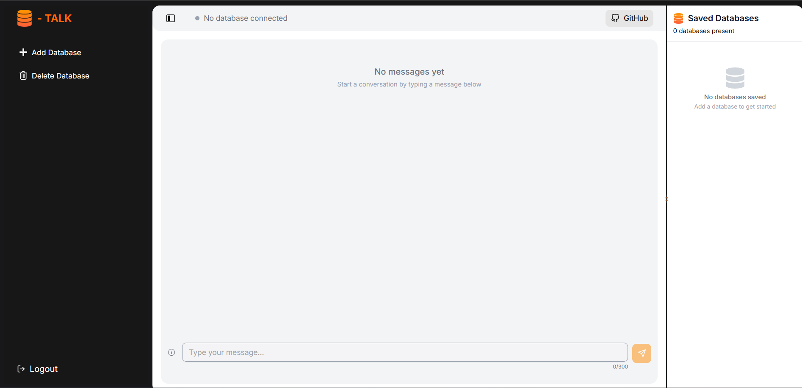
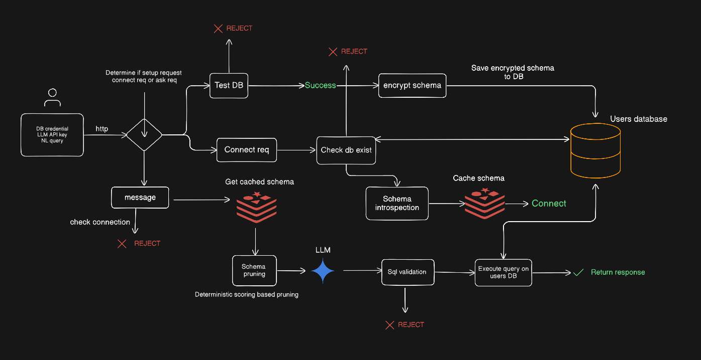

# DB-Talk

**Talk to Your Database in Natural Language**

DB-Talk is a self-hosted, AI-powered database query assistant that transforms natural language questions into database queries. Simply ask questions about your database in plain English, and it will execute the queries and return the results - no database query knowledge required!

> **Safe & Read-Only**: DB-Talk only executes SELECT queries for data retrieval. It never performs destructive operations (DELETE, UPDATE, DROP) or data manipulation, keeping your database safe.



## What is DB-Talk?

DB-Talk bridges the gap between you and your database by leveraging AI to understand natural language queries and convert them into executable database queries. Whether you're a business analyst, developer, or anyone who needs to query databases, DB-Talk makes it simple and intuitive.

**Currently supports PostgreSQL databases** with plans to add support for other databases in the future.

### Example Queries:
- "What are all the rows in the users table?"
- "Show me the top 10 customers by revenue"
- "How many orders were placed last month?"
- "List all products with price greater than $100"

The backend intelligently processes your natural language input, generates appropriate read-only queries, executes them against your connected database, and returns the results in a user-friendly format.

## Architecture



The project follows a modern full-stack architecture:

- **Frontend**: Next.js 16 with TypeScript
- **Backend**: Fastify with TypeScript
- **Database**: PostgreSQL for application data storage
- **Cache**: Redis for DB cacheing
- **AI**: Google Gemini AI for natural language processing and query generation
- **ORM**: Drizzle ORM for type-safe database operations

## Quick Start

Get DB-Talk up and running on your machine in seconds!

### Prerequisites

- Docker and Docker Compose installed
- Google Gemini AI API key ([Get one here](https://aistudio.google.com/app/api-keys))

### One-Command Setup

```bash
docker-compose up -d
```

The application will be available at:
- **Frontend**: http://localhost:3000
- **Backend API**: http://localhost:3001

For detailed setup instructions, including environment configuration see [Setup.md](Setup.md).

## Contribution

Want to contribute? Here's how:

### Fork And Clone The Forked Repository
```bash
git clone https://github.com/YOUR_USERNAME/DB-Talk.git
cd DB-Talk
```

### Run Backend
```bash
cd backend
pnpm install
pnpm dev
```

### Run Frontend
```bash
cd frontend
pnpm install
pnpm dev
```

### Database Migrations
```bash
cd backend
pnpm drizzle-kit migrate --config src/drizzle.config.ts
```

## Contributing

Contributions are welcome! Feel free to:
- Report bugs
- Suggest new features
- Submit pull requests
- Improve documentation

## License

ISC

For setup instructions and troubleshooting, see [Setup.md](Setup.md).

---